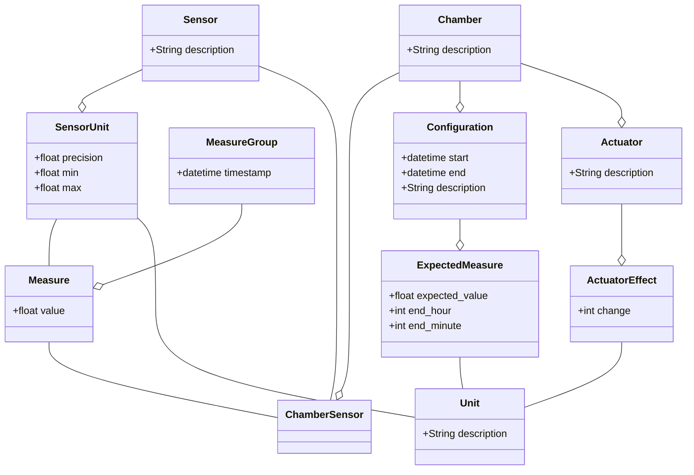

```mermaid
classDiagram

class Sensor{
    +String description
}

class SensorUnit{
    +float precision
    +float min
    +float max
}

class Unit{
    +String description
}

class MeasureGroup{
    +datetime timestamp
}

class Measure{
    +float value
}

%% The first value of the intervals (0000)
%% is implicit making the last interval
%% (2359) always required. Any configuration
%% of intervals in-between is be valid.
class ExpectedMeasure{
    +float expected_value
    +int end_hour
    +int end_minute
}

%% The configuration API is required to request
%% the units available for configuration through
%% the ChamberSensor->SensorUnit->Unit relation
class Configuration{
    +datetime start
    +datetime end
    +String description
}
class Chamber{
    +String description
}

class Actuator{
    +String description
}

class ActuatorEffect{
    +int change
}

MeasureGroup --o Measure
Measure -- ChamberSensor
SensorUnit -- Measure
Sensor --o SensorUnit
SensorUnit -- Unit
Chamber --o ChamberSensor
Sensor -- ChamberSensor
ExpectedMeasure -- Unit
Configuration --o ExpectedMeasure
Chamber --o Configuration
Chamber --o Actuator
Actuator --o ActuatorEffect
ActuatorEffect -- Unit

```