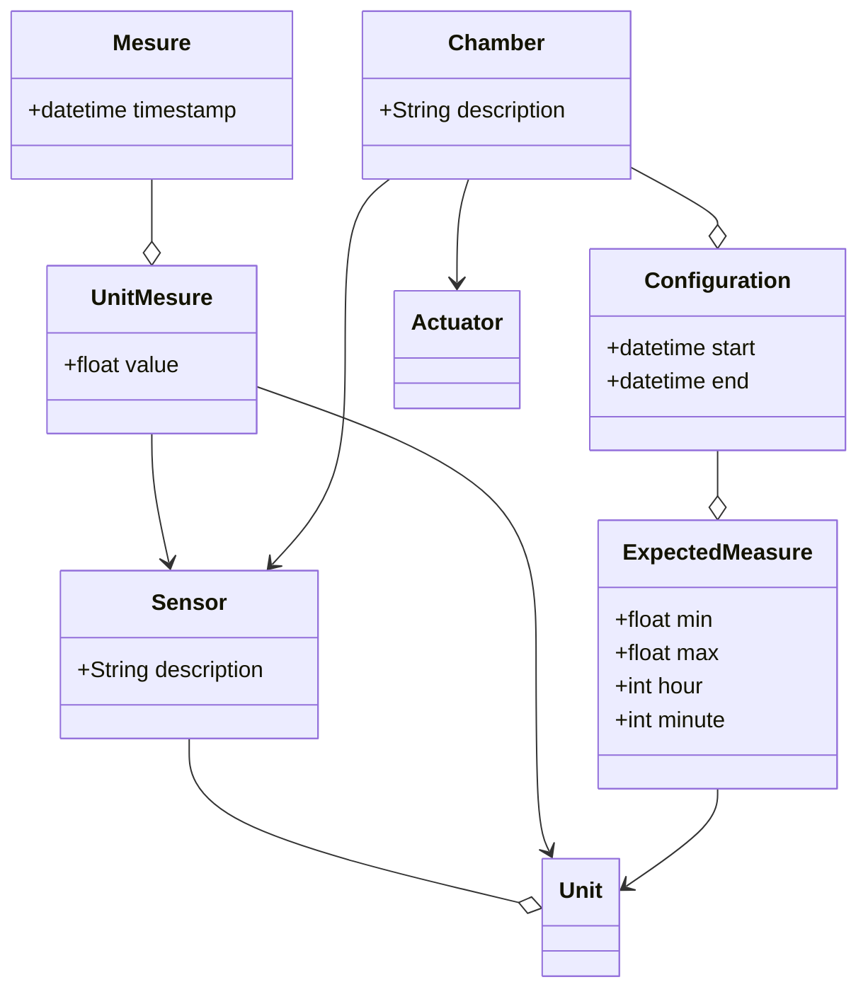

```mermaid
classDiagram

class Sensor{
    +String description
}
class Unit{ 
}
class Mesure{
    +datetime timestamp
}
class UnitMesure{
    +float value
}
class ExpectedMeasure{
    +float min
    +float max
    +int hour
    +int minute
}
class Configuration{
    +datetime start
    +datetime end
}
class Chamber{
    +String description
}


Sensor --o Unit
UnitMesure --> Unit
UnitMesure --> Sensor
Mesure --o UnitMesure
ExpectedMeasure --> Unit
Configuration --o ExpectedMeasure
Chamber --o Configuration
Chamber --> Sensor
Chamber --> Actuator


```