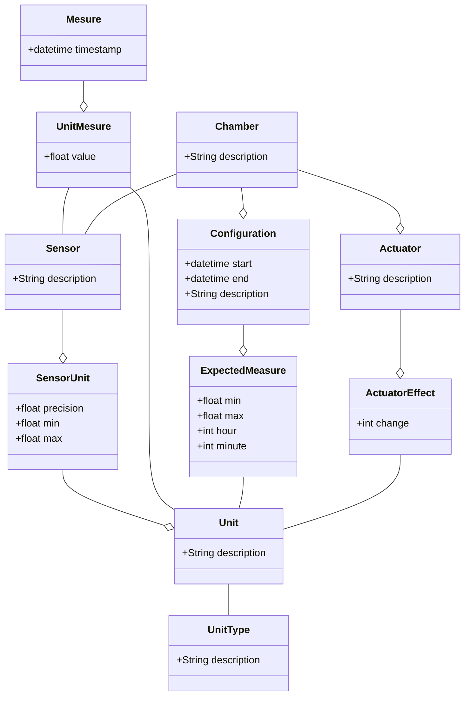

```mermaid
classDiagram

class Sensor{
    +String description
}

class SensorUnit{
    +float precision
    +float min
    +float max
}

class Unit{
    +String description
}

class UnitType{
    +String description
}

class Mesure{
    +datetime timestamp
}
class UnitMesure{
    +float value
}
class ExpectedMeasure{
    +float min
    +float max
    +int hour
    +int minute
}
class Configuration{
    +datetime start
    +datetime end
    +String description
}
class Chamber{
    +String description
}

class Actuator{
    +String description
}

class ActuatorEffect{
    +int change
}

Sensor --o SensorUnit
SensorUnit --o Unit
UnitMesure -- Unit
Unit -- UnitType
UnitMesure -- Sensor
Mesure --o UnitMesure
ExpectedMeasure -- Unit
Configuration --o ExpectedMeasure
Chamber --o Configuration
Chamber -- Sensor
Chamber --o Actuator
Actuator --o ActuatorEffect
ActuatorEffect -- Unit

```